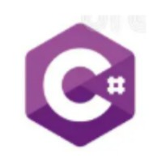
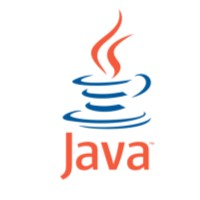
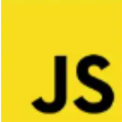
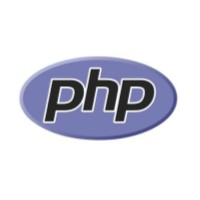
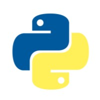
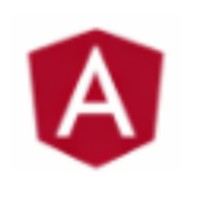
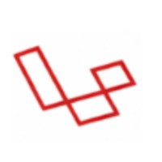
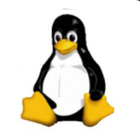
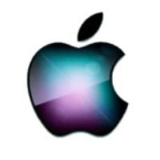
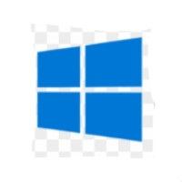

<html lang="es">

<head>
    <meta charset="UTF-8">
    <meta name="viewport" content="width=device-width, initial-scale=1.0">
    <title>Ultimo Trabajo de Electiva Desarrollo Web 1</title>
    

    
</head>

<body>

    <!-- NAVBAR -->
    <header class="header">
        

            <a href="#" class="brand-logo">MiSitio Web interactivo</a>
            <nav>
                <ul class="nav-menu" id="nav-menu">
                    <li class="nav-item"><a href="#frameworks" class="nav-link">Lenguajes</a></li>
                    <li class="nav-item"><a href="#frameworks" class="nav-link">Frameworks</a></li>
                    <li class="nav-item"><a href="#os" class="nav-link">S.Operativos</a></li>
                </ul>
            </nav>
        

    </header>

    <!-- CONTENIDO PRINCIPAL -->
    <main class="main-content">
        

            <h1 id="titlep" box-shadow: 0 100px 25px rgba(0, 0, 0, 0.22);>Bienvenidos al Ultimo Examen de Electiva Web 1</h1>

            <!-- TARJETA DE INTRODUCCIÓN CON LA CLASE CON MÁS SOMBRA -->

            

                

                     Programar es el arte de transformar ideas abstractas en instrucciones l&oacute;gicas que las
                    computadoras puedan ejecutar. A trav&eacute;s de <strong>lenguajes de
                    programaci&oacute;n</strong> como Python, C# o JavaScript, construimos la arquitectura
                    b&aacute;sica de cualquier software. Para agilizar este proceso existen los
                    <strong>frameworks</strong> —como React, Django o Flutter—, estructuras predefinidas que evitan
                    "reinventar la rueda", offrant herramientas listas para usar que mejoran la seguridad, la
                    mantenibilidad y la velocidad de desarrollo. Todo este ecosistema cobra vida sobre los
                    <strong>sistemas operativos</strong>: <strong>Linux</strong> lidera en servidores y desarrollo
                    backend; <strong>Windows</strong> domina el sector empresarial y de videojuegos;
                    <strong>macOS</strong> es la plataforma clave para el ecosistema Apple; mientras que
                    <strong>Android e iOS</strong> reciben aplicaciones m&oacute;viles nativas o construidas
                    mediante frameworks multiplataforma. En conjunto, el lenguaje aporta la l&oacute;gica, el
                    framework acelera la creaci&oacute;n y el sistema operativo proporciona el terreno donde la
                    tecnolog&iacute;a finalmente se ejecuta. 

                     El <strong>Código:</strong> Son las líneas de texto e instrucciones que escribe la persona programadora. 
                     El <strong>Lenguaje:</strong> Se usan idiomas especiales (como Python o Java) para que la computadora entienda las órdenes. 
                     La <strong>Ejecucion:</strong> La máquina lee el código y hace exactamente lo que se le pide sin dudar. 
                

            

            <!-- SECCIÓN LENGUAJES -->
            

                <h1>Lenguajes</h1>
            

            

                

                    
                    <h4>C Sharp</h4>
                    
Lenguaje multiparadigma desarrollado por Microsoft para la plataforma .NET.

                

                

                    
                    <h4>Java</h4>
                    
Lenguaje orientado a objetos enfocado en la portabilidad entre plataformas.

                

                

                    
                    <h4>JavaScript</h4>
                    
Lenguaje clave para el desarrollo web interactivo en el cliente y servidor.

                

                

                    
                    <h4>PHP</h4>
                    
Lenguaje de programación del lado del servidor ampliamente usado en la web.

                

                

                    
                    <h4>Python</h4>
                    
Lenguaje versátil y de sintaxis limpia usado en IA, web y ciencia de datos.

                

            

            <!-- SECCIÓN FRAMEWORKS -->
            

                <h1>Frameworks</h1>
            

            

                

                    
                    <h4>Angular</h4>
                    
Framework de desarrollo web creado por Google para aplicaciones SPA.

                

                

                    
                    <h4>Django</h4>
                    
Framework web de alto nivel basado en Python enfocado en rapidez y diseño limpio.

                

                

                    
                    <h4>Laravel</h4>
                    
Framework de desarrollo web en PHP con sintaxis elegante y expresiva.

                

                

                    
                    <h4>Svelte</h4>
                    
Compilador que convierte componentes en código JavaScript eficiente sin Virtual DOM.

                

                

                    
                    <h4>Vue.js</h4>
                    
Framework progresivo de JavaScript para la construcción de interfaces de usuario.

                

            

            <!-- SECCIÓN SISTEMAS OPERATIVOS -->
            

                <h1>Sistemas Operativos</h1>
            

            

                

                    
                    <h4>Android</h4>
                    
Sistema operativo móvil desarrollado por Google basado en el núcleo Linux.

                

                

                    
                    <h4>iOS</h4>
                    
Sistema operativo móvil de Apple exclusivo para sus dispositivos iPhone.

                

                

                    
                    <h4>Linux</h4>
                    
Sistema operativo de código abierto ampliamente utilizado en servidores y desarrollo.

                

                

                    
                    <h4>macOS</h4>
                    
Sistema operativo de escritorio desarrollado por Apple para sus computadoras Mac.

                

                

                    
                    <h4>Windows</h4>
                    
Sistema operativo dominante en el entorno empresarial y de videojuegos.

                

            

        

    </main>

    <!-- FOOTER -->
    <footer class="footer">
        

            

                

                    <h4>Mi Sitio Web</h4>
                    
Una plantilla base moderna y lista para tus proyectos.

                

                

                    <h4>Navegación</h4>
                    <ul>
                        <li><a href="#">Inicio</a></li>
                        <li><a href="#lenguajes">Lenguajes</a></li>
                        <li><a href="#frameworks">Frameworks</a></li>
                    </ul>
                

                

                    <h4>Contacto</h4>
                    
Email: info@misitio.com

                

            

            

                
&copy; 2026 MiSitio Web. Todos los derechos reservados.

            

        

    </footer>

</body>

</html>
